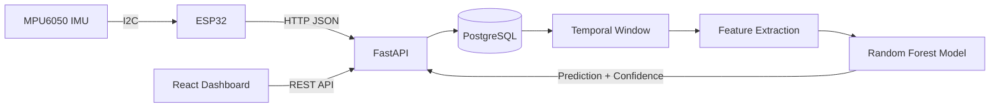

# Fitness IoT Platform

An end-to-end IoT activity-recognition system built with an ESP32, MPU6050, FastAPI, PostgreSQL, machine learning, Docker, AWS, and React.

The project connects a physical motion sensor to a complete software pipeline: sensor acquisition, network transmission, database persistence, feature engineering, activity classification, API inference, and a telemetry dashboard.

> **Status:** Fitness IoT Platform V1 is feature-complete. Public deployment is intentionally deferred until the final HTTPS and security-hardening pass.

---

## Overview

The system recognizes three movement states using six-axis MPU6050 motion data:

- **REST**
- **WALKING**
- **SQUAT**

A physical ESP32 reads accelerometer and gyroscope measurements from the MPU6050 and sends them to a FastAPI backend.

The backend stores sensor samples in PostgreSQL and uses a trained Random Forest model to classify the latest motion window.

A React dashboard consumes the API and displays predictions, model confidence, sensor-stream status, raw measurements, charts, and workout records.

---

## System Architecture



### End-to-End Data Flow

```text
Physical Movement
       ↓
MPU6050
       ↓
ESP32
       ↓
HTTP / JSON
       ↓
FastAPI
       ↓
PostgreSQL
       ↓
Latest Sensor Window
       ↓
Feature Extraction
       ↓
Random Forest
       ↓
Activity Prediction
       ↓
React Dashboard
```

The complete path from a physical movement to a visible prediction is implemented inside this project.

---

## Tech Stack

### Hardware

- ESP32-WROOM-32 development board
- MPU6050 / GY-521 IMU
- I2C communication

### Backend

- Python
- FastAPI
- Pydantic
- SQLAlchemy
- PostgreSQL
- JWT authentication infrastructure

### Machine Learning

- scikit-learn
- Random Forest
- NumPy
- joblib

### Frontend

- React
- Vite
- Recharts
- React Router
- CSS

### Infrastructure

- Docker
- Docker Compose
- AWS EC2
- Git
- GitHub

---

## ESP32 and Sensor Layer

The MPU6050 provides six motion measurements:

```text
accel_x
accel_y
accel_z

gyro_x
gyro_y
gyro_z
```

The sensor communicates with the ESP32 through I2C.

### Wiring Used in V1

| ESP32 | MPU6050 |
|---|---|
| `3V3` | `VCC` |
| `GND` | `GND` |
| `GPIO21` | `SDA` |
| `GPIO22` | `SCL` |

The MPU6050 uses the I2C address:

```text
0x68
```

The firmware reads both accelerometer and gyroscope registers, converts the raw values to usable units, creates a JSON payload, and sends the measurements to the backend.

The real Wi-Fi credentials are stored in a local `secrets.h` file and are excluded from Git.

A safe template is included as:

```text
firmware/fitness_iot_esp32/secrets.example.h
```

---

## Sensor API

A sensor sample sent by the ESP32 contains six values:

```json
{
  "accel_x": 0.02,
  "accel_y": -0.08,
  "accel_z": 1.01,
  "gyro_x": 1.4,
  "gyro_y": -0.8,
  "gyro_z": 0.5
}
```

The backend receives the sample through:

```text
POST /sensors
```

FastAPI then stores the sample in PostgreSQL.

Each record contains:

```text
id
accel_x
accel_y
accel_z
gyro_x
gyro_y
gyro_z
label
created_at
```

The `created_at` value is generated by the database when the sample is stored.

This allows the frontend to determine when the last sensor reading arrived.

---

## Dataset Collection

Three labeled recording sessions were collected using the actual ESP32 + MPU6050 hardware.

The three activity classes were:

```text
REST
WALKING
SQUAT
```

### Raw Dataset

| Session | REST | WALKING | SQUAT | Total |
|---|---:|---:|---:|---:|
| Session 1 | 48 | 46 | 46 | 140 |
| Session 2 | 48 | 41 | 49 | 138 |
| Session 3 | 49 | 49 | 49 | 147 |
| **Total** | **145** | **136** | **144** | **425** |

A sample represents one sensor reading, not one exercise repetition.

The dataset therefore contains:

```text
425 raw six-axis sensor samples
```

---

## Temporal Windowing

The machine-learning model does not classify individual sensor rows independently.

Instead, consecutive samples are grouped into short temporal windows.

```text
Window size = 5 samples
```

During the V1 recordings, the effective sampling rate was approximately:

```text
1.5–1.6 Hz
```

This means a five-sample window represents roughly three seconds of motion.

Using a time window gives the classifier information about how the sensor values change during movement rather than looking at only a single instant.

---

## Feature Engineering

Six sensor channels are used:

```text
accel_x
accel_y
accel_z
gyro_x
gyro_y
gyro_z
```

Five statistical features are calculated for every channel:

```text
mean
standard deviation
minimum
maximum
range
```

Therefore:

```text
6 sensor channels
×
5 statistics
=
30 input features
```

These 30 features represent each motion window.

---

## Machine-Learning Model

The project uses a Random Forest classifier.

```python
RandomForestClassifier(
    n_estimators=200,
    random_state=42
)
```

The model predicts one of three classes:

```text
REST
WALKING
SQUAT
```

The trained model package also stores the feature-column order, sensor-column names, and window size.

This ensures that inference uses the same data structure that was used during model training.

---

## Training and Test Strategy

The dataset was intentionally split by recording session.

The project does **not** randomly mix individual rows from the same recording into both training and test data.

Instead:

```text
Training data:
Session 1
Session 2

Held-out test data:
Session 3
```

After non-overlapping window generation:

```text
Training windows: 53

Held-out test windows: 27
```

The held-out Session 3 contains:

| Activity | Windows |
|---|---:|
| REST | 9 |
| WALKING | 9 |
| SQUAT | 9 |
| **Total** | **27** |

---

## Evaluation Result

The trained Random Forest classified all 27 held-out windows correctly during this experiment.

```text
Held-out Session 3 accuracy: 1.00
```

The confusion matrix contained:

```text
REST:    9 / 9 correct
WALKING: 9 / 9 correct
SQUAT:   9 / 9 correct
```

### Important Limitation

The 1.00 result must be interpreted carefully.

This project does **not** claim perfect real-world activity recognition.

The evaluation dataset is:

- small,
- collected from one participant,
- recorded during one project period,
- collected with similar sensor placement,
- limited to three activity classes,
- evaluated using only 27 held-out windows.

Sensor orientation and placement were also observed to affect predictions.

Therefore, the result demonstrates that the end-to-end prototype works under the tested conditions. It does not prove that the model will generalize perfectly across different people, devices, placements, or environments.

---

## Model Inference

The trained model is loaded by the FastAPI application.

When:

```text
GET /predict
```

is called, the backend:

1. loads the latest five sensor records from PostgreSQL,
2. restores their chronological order,
3. computes the same 30 statistical features used during training,
4. passes the feature vector to the Random Forest,
5. obtains the predicted class,
6. obtains the classifier probability output,
7. returns the result to the client.

A prediction response contains information such as:

```json
{
  "prediction": "SQUAT",
  "confidence": 0.925,
  "window_size": 5,
  "latest_sensor_id": 6826,
  "latest_sensor_at": "timestamp"
}
```

The confidence value is the Random Forest `predict_proba` output.

It should not be interpreted as a calibrated real-world probability.

---

## Live Hardware Inference

The complete hardware-to-model pipeline was tested using the real ESP32 and MPU6050.

Observed live classifications included:

```text
REST
WALKING
SQUAT
```

During live testing, device orientation was found to be important.

For example, placing the sensor on a table in an orientation different from the training recordings could cause an incorrect activity prediction.

Holding the sensor in a position similar to the dataset collection setup produced substantially more consistent results.

This behavior is documented as a limitation rather than hidden.

---

## React Telemetry Dashboard

A React frontend was built to visualize the system.

The UI uses a dark engineering / telemetry-dashboard design.

### Overview

The Overview page displays:

```text
Current Activity
Prediction Confidence
Data Stream Status
Last Sensor Sample
Model Information
Sensor Trend
Latest Sensor Values
Recent Workouts
```

The dashboard polls the backend periodically rather than requiring a manual page refresh.

---

## Stream Status

The backend returns the timestamp of the latest sensor sample.

The frontend compares that timestamp with the current time.

Conceptually:

```text
Recent sensor sample
        ↓
Stream considered active

No recent sensor sample
        ↓
Stream considered stale
```

The dashboard therefore does not need a direct physical connection to the ESP32 to determine whether new data is still arriving.

It determines stream freshness from the age of the latest stored sensor sample.

---

## Sensor Data Page

The Sensor Data page displays:

- accelerometer trends,
- gyroscope trends,
- latest raw values,
- timestamps,
- recent sensor samples.

Accelerometer values are displayed in:

```text
g
```

Gyroscope values are displayed in:

```text
degrees per second
```

---

## Workout Tracking

The project also contains workout CRUD functionality.

Supported operations include:

```text
Create
Read
Update
Delete
```

Workout data contains:

```text
exercise
sets
reps
weight
total_volume
```

Total volume is calculated as:

```text
sets × reps × weight
```

The API also supports:

```text
exercise filtering
minimum-volume filtering
sorting
pagination
```

---

## Authentication

The backend includes:

```text
User registration
User login
Password hashing
JWT generation
JWT validation
Authenticated /auth/me endpoint
```

Passwords are stored as hashes rather than plaintext.

The frontend stores and sends the JWT when interacting with authenticated application flows.

### Current Authorization Status

Authentication infrastructure is implemented, but the workout CRUD routes are not yet fully protected server-side.

This is intentionally documented as part of the final production-hardening work rather than presented as completed authorization.

---

## Docker

The backend runs inside Docker.

The Docker image contains:

```text
FastAPI backend
Python dependencies
Machine-learning model
```

Docker Compose runs separate services for:

```text
api
db
```

The database service uses:

```text
PostgreSQL 16
```

A health check ensures that PostgreSQL is ready before the API starts.

A named Docker volume preserves PostgreSQL data between container restarts.

---

## AWS

The backend has been deployed and tested on an AWS EC2 Ubuntu instance.

The EC2 machine runs the Dockerized application stack.

The V1 backend architecture is:

```text
Internet
   ↓
AWS EC2
   ↓
Docker Compose
   ├── FastAPI container
   └── PostgreSQL container
```

Live ESP32 sensor requests were successfully received by the AWS-hosted API during project testing.

---

## Frontend Structure

The React application contains pages for:

```text
Overview
Workouts
Sensor Data
Login
```

Reusable frontend components include:

```text
Confidence Bar
Sensor Chart
Raw Sensor Values
Recent Workouts Table
Stream Status Badge
Workout Form
Sidebar
```

API communication is separated into dedicated client modules for:

```text
authentication
sensor data
workouts
```

---

## API Overview

| Method | Endpoint | Description |
|---|---|---|
| `GET` | `/health` | API health check |
| `GET` | `/hello` | Basic API test |
| `POST` | `/auth/register` | Register a user |
| `POST` | `/auth/login` | Login and receive JWT |
| `GET` | `/auth/me` | Get authenticated user |
| `POST` | `/workouts` | Create workout |
| `GET` | `/workouts` | List/filter/sort workouts |
| `GET` | `/workouts/{id}` | Get workout |
| `PUT` | `/workouts/{id}` | Update workout |
| `DELETE` | `/workouts/{id}` | Delete workout |
| `POST` | `/sensors` | Store a sensor sample |
| `GET` | `/sensors` | Get recent sensor samples |
| `GET` | `/predict` | Run activity inference |

---

## Repository Structure

```text
fitness-iot-platform/
│
├── backend/
│   ├── routers/
│   │   ├── auth.py
│   │   ├── sensors.py
│   │   └── workouts.py
│   ├── database.py
│   ├── main.py
│   ├── models.py
│   ├── schemas.py
│   ├── security.py
│   └── requirements.txt
│
├── firmware/
│   └── fitness_iot_esp32/
│       ├── fitness_iot_esp32.ino
│       ├── http_client.ino
│       ├── i2c_scanner.ino
│       ├── mpu6050.ino
│       └── secrets.example.h
│
├── frontend/
│   ├── src/
│   │   ├── api/
│   │   ├── components/
│   │   ├── context/
│   │   ├── hooks/
│   │   ├── pages/
│   │   └── styles/
│   ├── package.json
│   └── vite.config.js
│
├── ml/
│   ├── train_model.py
│   └── ...
│
├── Dockerfile
├── docker-compose.yml
└── README.md
```

---

## Running the Backend Locally

Create a root `.env` file with your own values.

Example:

```env
POSTGRES_USER=your_postgres_user
POSTGRES_PASSWORD=your_postgres_password
POSTGRES_DB=fitness_db
POSTGRES_HOST=db

JWT_SECRET_KEY=replace_with_a_random_secret
JWT_ALGORITHM=HS256
ACCESS_TOKEN_EXPIRE_MINUTES=30

CORS_ORIGINS=http://localhost:5173
```

Then run:

```bash
docker compose up -d --build
```

The backend becomes available at:

```text
http://localhost:8000
```

FastAPI interactive documentation:

```text
http://localhost:8000/docs
```

---

## Running the Frontend Locally

Enter the frontend directory:

```bash
cd frontend
```

Create the local frontend environment file:

```bash
cp .env.example .env
```

Install dependencies:

```bash
npm install
```

Start Vite:

```bash
npm run dev
```

The frontend environment variable is:

```env
VITE_API_BASE_URL=http://localhost:8000
```

The development frontend runs at:

```text
http://localhost:5173
```

---

## Running the ESP32 Firmware

Create the local firmware secret file:

```bash
cp firmware/fitness_iot_esp32/secrets.example.h \
   firmware/fitness_iot_esp32/secrets.h
```

Then provide your own Wi-Fi credentials in the local `secrets.h`.

The real file is intentionally excluded from Git.

The firmware currently targets the V1 backend configuration used during testing.

Production endpoint and ingestion-authentication changes are deferred to the public-deployment hardening phase.

---

## Secret Management

Sensitive local files are excluded through `.gitignore`.

Examples include:

```text
.env
*.pem
secrets.h
```

The repository contains a safe:

```text
secrets.example.h
```

instead of real Wi-Fi credentials.

Generated ML datasets are also excluded from the repository.

---

## Security Status

Fitness IoT Platform V1 is currently intended for code review, local demonstration, and controlled project testing.

It is **not currently presented as a public production service**.

Before exposing the application as a public live demo, the remaining hardening work includes:

```text
HTTPS for the external API
Production CORS allow-list
Workout authorization enforcement
ESP32 sensor-ingestion authentication
Credential rotation and hygiene checks
Final public deployment smoke testing
```

This work is intentionally separated from feature development.

---

## Current Limitations

The current prototype has several known limitations:

- the dataset was collected from one participant,
- only three activity classes are supported,
- the dataset is relatively small,
- device placement affects classification,
- sensor orientation affects classification,
- the effective sampling rate is low,
- individual sensor readings are transmitted through HTTP,
- model confidence is not a calibrated probability,
- multi-user generalization has not been evaluated,
- cross-device generalization has not been evaluated,
- public deployment security hardening is still pending.

These limitations are documented explicitly rather than presenting the prototype as a production-grade activity-recognition system.

---

## Engineering Scope

The goal of this project was not simply to train a classifier or create a REST API.

The main goal was to connect multiple engineering layers into one working system:

```text
Physical Sensor
      ↓
Embedded Firmware
      ↓
Networking
      ↓
Backend API
      ↓
Database
      ↓
Dataset
      ↓
Machine Learning
      ↓
Inference
      ↓
Cloud Deployment
      ↓
Frontend Dashboard
```

This required working across embedded systems, backend development, databases, machine learning, cloud infrastructure, and frontend integration.

---

## What I Learned

The project provided practical experience with:

- ESP32 development,
- I2C communication,
- MPU6050 registers,
- accelerometer and gyroscope data,
- HTTP and JSON communication,
- FastAPI,
- Pydantic validation,
- SQLAlchemy ORM,
- PostgreSQL,
- CRUD operations,
- filtering and pagination,
- authentication and JWT,
- Docker images and containers,
- Docker Compose,
- environment variables,
- AWS EC2,
- sensor-data collection,
- dataset labeling,
- temporal windowing,
- feature engineering,
- Random Forest classification,
- train/test separation,
- model serialization,
- inference APIs,
- React,
- REST API consumption,
- polling,
- telemetry visualization,
- CORS,
- Git and GitHub.

---

## Portfolio Summary

> Built an end-to-end IoT activity-recognition pipeline using ESP32/MPU6050 sensor data, FastAPI, PostgreSQL and AWS; collected labeled accelerometer/gyroscope sessions, engineered temporal-window features, trained a Random Forest classifier for REST/WALKING/SQUAT recognition, integrated model inference into the backend, and built a React telemetry dashboard for system monitoring.

---

## Project Status

### Fitness IoT Platform V1 — Feature Complete

Core development is complete.

Remaining work is limited to:

```text
Portfolio presentation
README / screenshots
Optional public deployment
HTTPS / security hardening before public exposure
Project-defense and interview review
```

No additional application features are currently planned for V1.